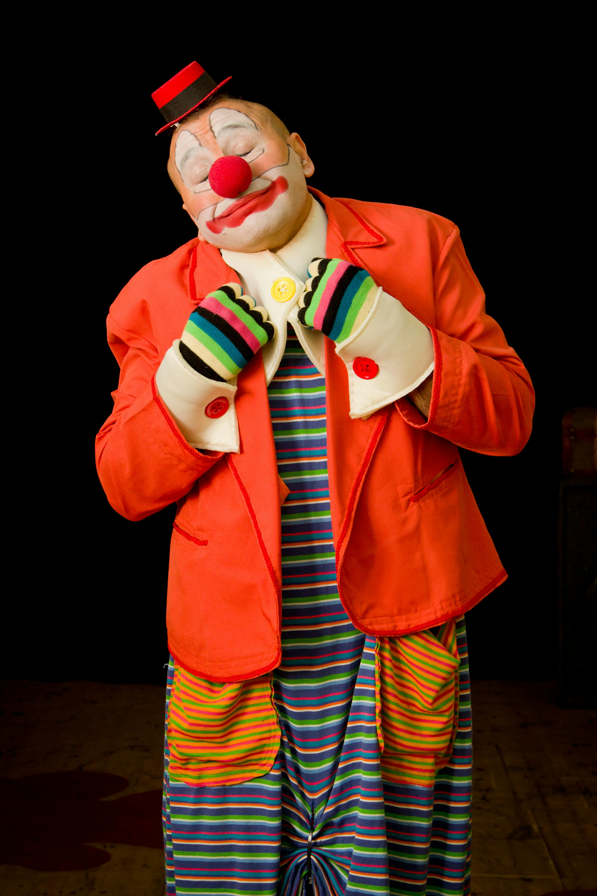

# Makeup Tips For Coders 
### *Guide by Makala Jasmine*

### When you walk into the workroom you need to be ready to **work it**
#### It's important to remember to always put your best face forward
## Inspiration Lookbook:




### Products Linked [Here](https://www.clownantics.com/collections/makeup)

```python
import random 
clown_makeup = {"Classic": "Red", "Pastel": "Pink", "Gothic": "Black", "Sad": "Blue", "Country": "Yeee-hallow"}
makeup_style = random.choice(list(clown_makeup.keys()))
print(f"Todays Look: {makeup_style} & Color Palette: {clown_makeup[makeup_style]}")
```
